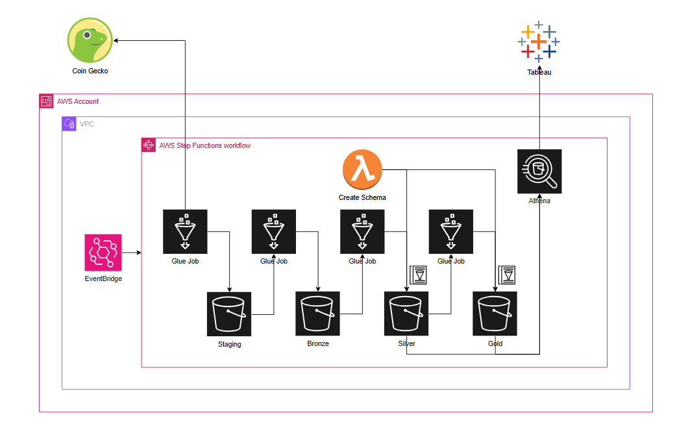
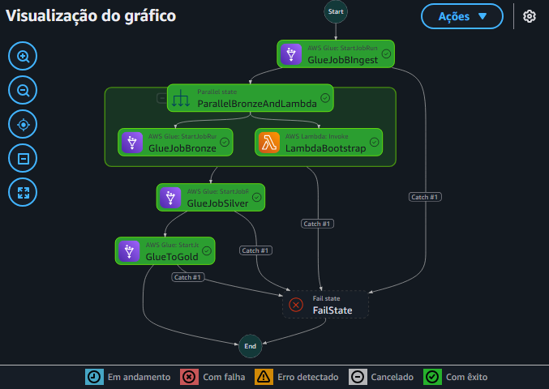

# Coingecko Data Ingestion and Preparation Project

## Description

This project aims to read data from the Coingecko API, process it, and deliver it prepared for analysis through a robust and scalable data pipeline.
 

## Project Structure

- `infra/` — Infrastructure as code using Terraform to provision AWS resources.
- `assets/` — Images and other static files, including the project cover.
- `.github/workflows/` — GitHub Actions CI/CD workflow configurations.

## How to Reproduce

1. Obtain an API key from Coingecko (https://www.coingecko.com/en/api).
2. Register this key in AWS Secrets Manager (or other secret manager used in your pipeline).
3. Run the pipeline using Terraform to provision the infrastructure.
4. The automated pipeline will perform ingestion, processing, and organization of data for analysis.

---

## Challenges and Trade-offs

### 1. API Key Management

I faced a lot of difficulty trying to send the API key to Glue. I tried several approaches, such as:

- Passing via TFVARS variables
- Using Secrets Manager directly in Glue
- AWS Systems Manager Parameter Store

In the end, I chose **Parameter Store** to simplify, as it allows storing the key securely and accessibly, avoiding the complexity of additional setups like KMS with dynamic keys.

--- 

### 2. Redshift Configuration

Configuring Redshift presented challenges, especially to deploy Spectrum and other integrations via Terraform. A complex workaround was required along with creating a VPC with specific settings to ensure proper operation.

This process demanded in-depth knowledge of AWS networking and security to guarantee correct communication and authorization between services.

---

### 3. IAM Authentication on Redshift

To simplify access management, I chose to use **IAM authentication** instead of creating specific users on Redshift.

Advantages:

- Centralized permission management within IAM
- No need to manage separate users and passwords on the database
- Improved security and auditability by using IAM policies

---

### 4. Choosing Athena for Analytics

Although Redshift is a traditional choice for analytics, I opted for **Athena** due to its simplicity and suitability for the expected query volume and frequency.

Reasons:

- Expected queries are not very complex nor frequent
- Reduced operational complexity
- Easy integration with Glue Catalog and S3 stored data

---

### 5. Using Lambda for Glue Catalog Schema Creation

Instead of a Glue Job to create schemas and tables in the Glue Catalog, I opted for a **Lambda function** for this bootstrap task.

Reasons:

- Schema and table creation is a **one-time** process.
- Lambda is cheaper than Glue Jobs, which are optimized for ongoing heavy processing.
- This reduces processing cost and simplifies the architecture.

---

## Contact

For questions or contributions, please open an issue or contact me at linkedin: Rafael Gensen

---

## Future Enhancements 

- Expand Glue analyses to include predictive views, enabling more advanced forecasting and insights.
- Increase data load frequency to daily or near real-time to improve data freshness and responsiveness.
- Develop monitoring dashboards for better observability of pipeline health, data quality, and system performance.
- Implement automated alerting on pipeline failures or anomalies to proactively address issues.
- Enhance security by integrating AWS KMS for secret management and encryption at rest.
- Optimize Glue job performance and cost by fine-tuning resource allocation and job orchestration.
- Explore integration with other AWS analytics services like QuickSight for richer visualization capabilities.
